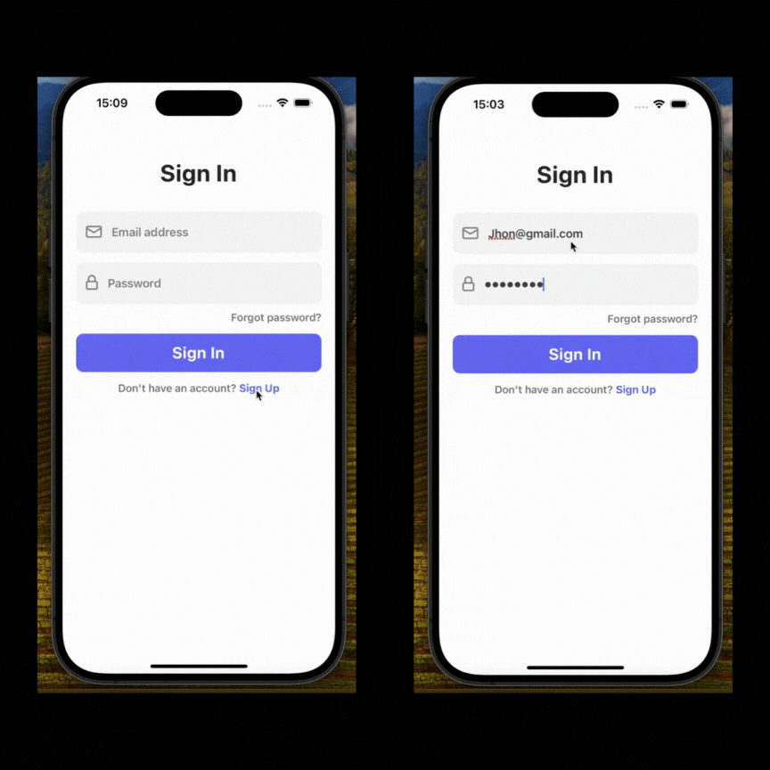

# Chat Application

- This application is a chat application that utilizes Firebase Firestore as its backend database. It is developed with React Native and allows users to engage in real-time messaging.

## Features:

- User Login and Authentication: Users can authenticate and log in to the application using Firebase Authentication. This ensures secure access to the chat features.

- Real-Time Messaging: Users can engage in real-time messaging in specific rooms or with individual users. Each message is stored in the Firebase Firestore database and updated in real-time.

- Sending and Receiving Messages: Users can compose, send, and receive text messages. Each message includes the sender's name, profile picture, and message text.

## Technologies Used:

- React Native: Utilized for building the user interface and developing the application.
- Firebase Firestore: Used for storing real-time messaging data and facilitating synchronization.
- Firebase Authentication: Implemented for user authentication and login functionality.
- This chat application provides an easy and effective way for users to communicate in real-time. It facilitates communication between both individuals and groups, offering a fast and reliable experience through Firebase's real-time database solution.

